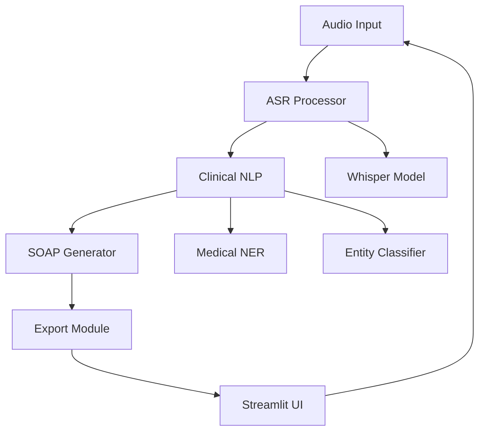

# MediSynth Ag- 💻 **Web Interface**: Professional enterprise-grade UI with clinical design standards
- 📄 **Export Options**: Download notes as PDF or JSON
- 🔧 **Modular Design**: Clean, maintainable enterprise codebase
- 🐳 **Docker Ready**: Containerized deployment support🩺

An AI-powered multimodal assistant for automating healthcare documentation. This system processes doctor-patient conversations and generates structured medical notes in SOAP format using advanced speech recognition and medical NLP.

[](https://www.python.org/downloads/)
[](https://streamlit.io/)
[](https://opensource.org/licenses/MIT)

## 🚀 Features

- 🎤 **Audio Input**: Support for WAV/MP3 files and live microphone recording
- 🗣️ **Speech-to-Text**: High-quality transcription using OpenAI Whisper
- 🧠 **Medical NLP**: Extract clinical entities (symptoms, medications, vitals, conditions)
- 📝 **SOAP Generation**: Automated structured clinical note creation
## � Features

- 🎤 **Audio Input**: Support for WAV/MP3 files and live microphone recording
- 🗣️ **Speech-to-Text**: High-quality transcription using OpenAI Whisper
- 🧠 **Medical NLP**: Extract clinical entities (symptoms, medications, vitals, conditions)  
- 📝 **SOAP Generation**: Automated structured clinical note creation
- 💻 **Multiple UI Themes**: Choose from 5 different interface styles:
  - 🏥 Professional Enterprise (Clinical-grade)
  - 🌟 Ultra-Modern (Glassmorphism design)
  - 👑 Luxury Dark Mode (Premium gold accents)
  - 🎨 Advanced Modern (Sophisticated interface)
  - 📱 Standard (Classic design)
- 📄 **Export Options**: Download notes as PDF or JSON
- 🔧 **Modular Design**: Clean, maintainable enterprise codebase
- 🐳 **Docker Ready**: Containerized deployment support
- 📄 **Export Options**: Download notes as PDF or JSON
- � **Modular Design**: Clean, maintainable codebase
- �🐳 **Docker Ready**: Containerized deployment support

## 📁 Project Structure

```
MediSynth Agent/
├── 📂 asr/                    # Audio Speech Recognition
│   ├── __init__.py            # ASR processor with Whisper
│   └── recorder.py            # Audio recording utilities
├── 📂 nlp/                    # Medical NLP & SOAP Generation
│   ├── __init__.py            # Clinical text processor
│   └── soap_generator.py      # SOAP note generator
├── 📂 ui/                     # Streamlit Web Interface
│   └── __init__.py            # Main UI application
├── 📂 utils/                  # Utility Functions
│   └── __init__.py            # File handling, PDF export, logging
├── 📂 config/                 # Configuration Management
│   └── __init__.py            # App settings and model configs
├── 📂 tests/                  # Unit Tests
│   └── test_medisynth.py      # Component tests
├── 📂 data/                   # Sample Data
│   └── sample_conversations.md # Test scenarios
├── 📄 requirements.txt        # Python dependencies
├── 📄 Dockerfile            # Container configuration
├── 📄 docker-compose.yml    # Multi-service setup
├── 📄 demo.py               # Demo version with mock data
├── 📄 main.py               # Main application entry point
├── 📄 test_medisynth.py     # Test runner
└── 📄 setup.py              # Setup and installation script
```

## 🛠️ Installation

### Prerequisites
- Python 3.9 or higher
- Git
- (Optional) Docker for containerized deployment

### Quick Start

1. **Clone the repository**
   ```bash
   git clone <repository-url>
   cd "MediSynth Project"
   ```

2. **Install dependencies**
   ```bash
   pip install -r requirements.txt
   ```

3. **Choose your preferred interface style:**

   **🏥 Professional Demo** (Enterprise-grade clinical interface)
   ```bash
   streamlit run demo_professional.py
   ```

   **🌟 Ultra-Modern Demo** (Cutting-edge glassmorphism design)
   ```bash
   streamlit run demo_ultramodern.py
   ```

   **👑 Luxury Demo** (Premium dark mode with gold accents)
   ```bash
   streamlit run demo_luxury.py
   ```

   **🎨 Advanced Demo** (Sophisticated modern interface)
   ```bash
   streamlit run demo_advanced.py
   ```

   **📱 Standard Demo** (Classic interface)
   ```bash
   streamlit run demo.py
   ```

4. **Or run the full application**
   ```bash
   streamlit run main.py
   ```

### Automated Setup
```bash
python setup.py
```

### Docker Deployment
```bash
docker-compose up
```

## 🎯 Usage

### Demo Interfaces Available

**🏥 Professional Enterprise** (Port 8505)
- Clean, clinical-grade interface designed for healthcare professionals
- Enterprise color schemes with medical blue accents
- Professional typography and status indicators
- HIPAA-compliant design patterns

**🌟 Ultra-Modern Glassmorphism** (Port 8506) 
- Cutting-edge design with glassmorphism effects
- Smooth animations and gradient backgrounds
- Advanced visual effects and modern aesthetics
- Premium user experience with floating elements

**👑 Luxury Dark Mode** (Port 8507)
- Premium dark theme with gold luxury accents
- Sophisticated animations and premium typography
- High-end user experience with elegant styling
- Executive-level interface for premium users

**🎨 Advanced Modern** (Port 8508)
- Sophisticated interface with advanced CSS frameworks
- Modern design patterns and smooth interactions
- Professional workflow visualization
- Enhanced user experience with premium components

**📱 Standard Demo** (Default)
- Classic interface with reliable functionality
- Standard Streamlit styling with basic enhancements
- Simple, clean design for everyday use

### Usage Instructions by Interface

#### Professional Enterprise Demo
1. Launch: `streamlit run demo_professional.py` 
2. Access: http://localhost:8505
3. Features: Clinical workflow, enterprise styling, professional documentation

#### Ultra-Modern Demo  
1. Launch: `streamlit run demo_ultramodern.py`
2. Access: http://localhost:8506
3. Features: Glassmorphism design, advanced animations, cutting-edge UI

#### Luxury Demo
1. Launch: `streamlit run demo_luxury.py` 
2. Access: http://localhost:8507
3. Features: Premium dark mode, luxury aesthetics, gold accents

### Full Application
1. Launch: `streamlit run main.py`
2. **Audio Input**: Upload WAV/MP3 files or record live audio
3. **Transcription**: AI converts speech to text with confidence scores
4. **Entity Analysis**: Medical terms are automatically highlighted
5. **SOAP Notes**: Structured clinical documentation is generated
6. **Export**: Download as PDF or JSON format

### Example Workflow
```
Audio Upload → Transcription → Entity Extraction → SOAP Generation → Export
     ↓              ↓              ↓                ↓              ↓
  [Upload MP3] → [Chest pain...] → [Symptoms: chest pain] → [S: Patient reports...] → [Download PDF]
```

## 🧪 Testing

Run comprehensive tests:
```bash
python test_medisynth.py
```

Expected output:
```
🩺 MediSynth Agent - Test Suite
============================================================
✅ Config loaded - ASR Model: base
✅ Utils working  
✅ SOAP generator working
✅ Whisper available
✅ Transformers available
✅ PyTorch available
✅ ASR processor can be created
🎉 ALL TESTS PASSED! MediSynth Agent is ready to use.
```

## 📊 Sample Output

### Input Audio
*"Good morning doctor. I've been having chest pain since last night..."*

### Generated SOAP Note
```
SUBJECTIVE:
-----------
Chief Complaint: Chest pain since last night
Patient reports sharp chest pain that started around 10 PM yesterday. 
Pain is intermittent and worsens with deep breathing.

OBJECTIVE:
----------
Vital Signs: [To be documented during exam]
Physical Examination: [To be documented during exam]

ASSESSMENT:
-----------
• Rule out angina/coronary artery disease
• Consider musculoskeletal chest pain

PLAN:
-----
Diagnostic Studies:
• Order ECG
• Consider chest X-ray
Follow-up: Return if symptoms worsen
```

## ⚙️ Configuration

### Environment Variables
Create a `.env` file:
```bash
# Model Settings
ASR_MODEL_SIZE=base          # tiny, base, small, medium, large
ASR_DEVICE=cpu              # cpu or cuda
USE_GPU_FOR_NLP=false       # Enable GPU acceleration

# Audio Settings  
AUDIO_SAMPLE_RATE=16000
MAX_UPLOAD_SIZE=100         # MB

# Export Settings
PDF_EXPORT_ENABLED=true
JSON_EXPORT_ENABLED=true
```

### Model Configuration
- **Whisper Models**: `tiny` (fast) → `large` (accurate)
- **Medical NER**: Biomedical transformer models
- **Device**: CPU (default) or CUDA for GPU acceleration

## 🚨 Dependencies

### Core Requirements
- `streamlit>=1.28.0` - Web framework
- `openai-whisper>=20231117` - Speech recognition
- `transformers>=4.35.0` - Medical NLP models
- `torch>=2.1.0` - Deep learning backend
- `librosa>=0.10.1` - Audio processing
- `spacy>=3.7.0` - Text processing
- `reportlab>=4.0.0` - PDF generation

### Audio Processing
- `pydub>=0.25.1` - Audio format conversion
- `soundfile>=0.12.1` - Audio file I/O
- `audio-recorder-streamlit` - Web audio recording

## 🏗️ Architecture



## 🔧 Development

### Adding New Features
1. **New NLP Models**: Update `nlp/__init__.py`
2. **Export Formats**: Extend `utils/__init__.py`
3. **UI Components**: Modify `ui/__init__.py`

### Testing
```bash
# Run all tests
python test_medisynth.py

# Test specific components
python -m pytest tests/

# Test with coverage
python -m pytest --cov=. tests/
```

## 🚀 Deployment

### Local Development
```bash
streamlit run main.py --server.port 8501
```

### Production (Docker)
```bash
docker build -t medisynth-agent .
docker run -p 8501:8501 medisynth-agent
```

### Cloud Deployment
Compatible with:
- Streamlit Cloud
- AWS EC2/ECS
- Google Cloud Run
- Azure Container Instances

## 🔒 Security & Privacy

- **No PHI Storage**: Audio files are processed locally and not stored
- **Temporary Files**: Automatically cleaned after processing  
- **Educational Use**: Designed for research and training purposes
- **HIPAA Compliance**: Additional security measures needed for production

## 🤝 Contributing

1. Fork the repository
2. Create feature branch: `git checkout -b feature/amazing-feature`
3. Commit changes: `git commit -m 'Add amazing feature'`
4. Push to branch: `git push origin feature/amazing-feature`
5. Open Pull Request

## 📝 License

MIT License - See [LICENSE](LICENSE) file for details.

**⚠️ Important**: This project is for educational and research purposes only. Not intended for actual clinical use without proper validation and compliance measures.

## 🙏 Acknowledgments

- OpenAI for Whisper speech recognition
- Hugging Face for transformer models
- Streamlit team for the excellent web framework
- Medical NLP research community

## 📞 Support

- 📧 Issues: [GitHub Issues](../../issues)
- 📖 Documentation: See `/docs` folder
- 💬 Discussions: [GitHub Discussions](../../discussions)

---

**MediSynth Agent** - Transforming healthcare documentation with AI 🏥✨
